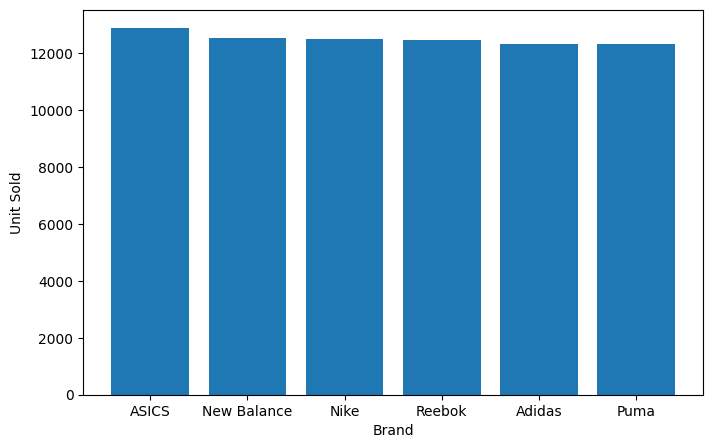
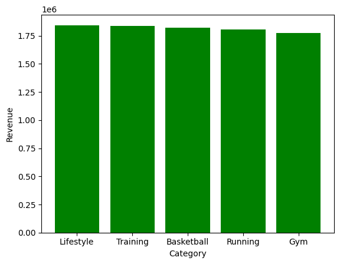
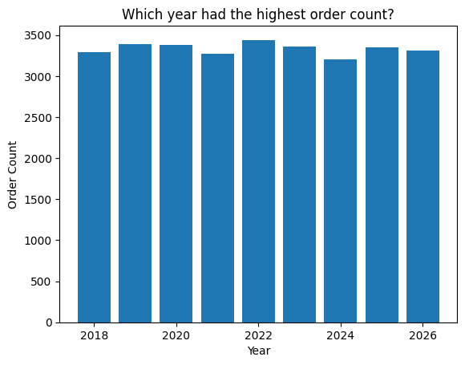
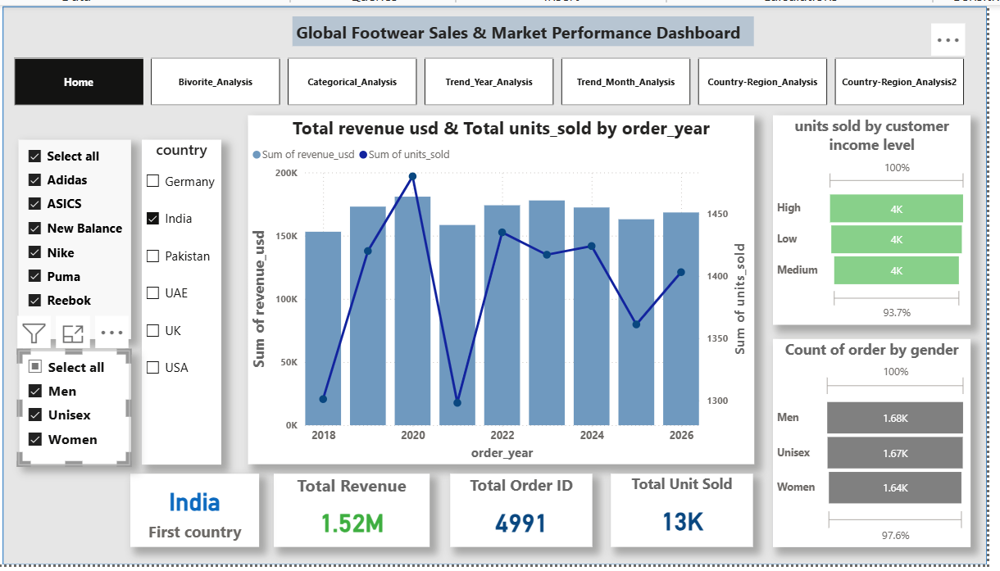
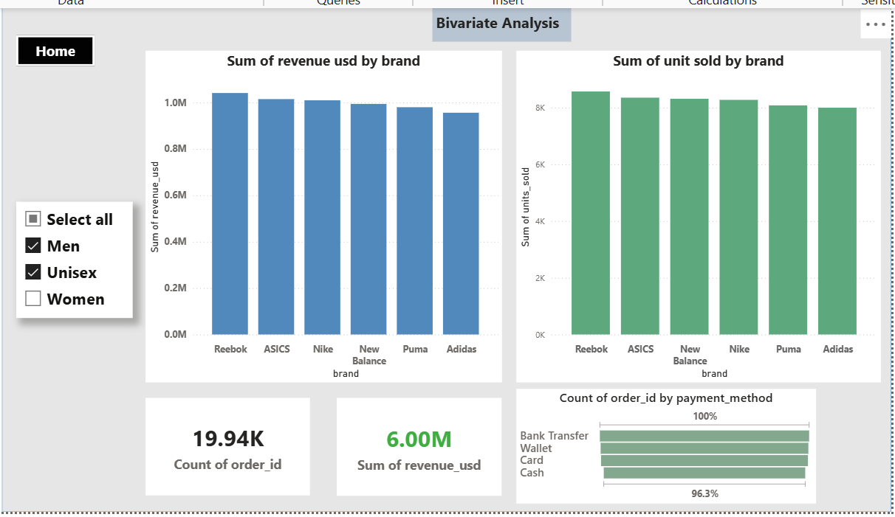
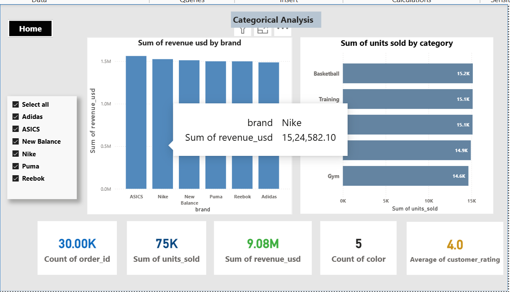
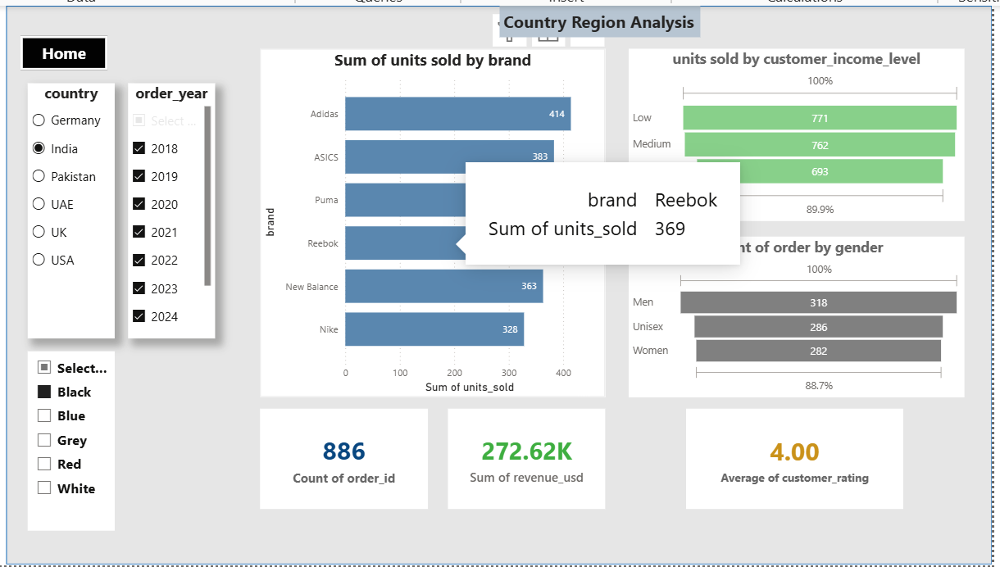
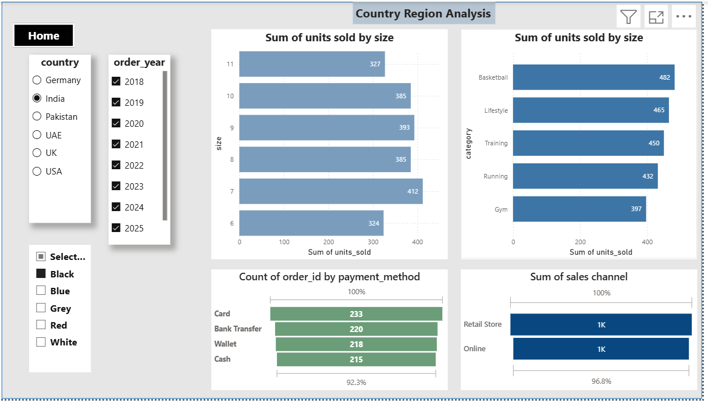
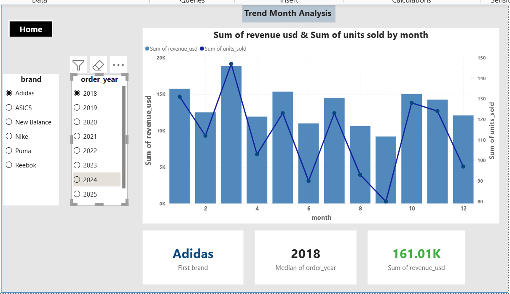
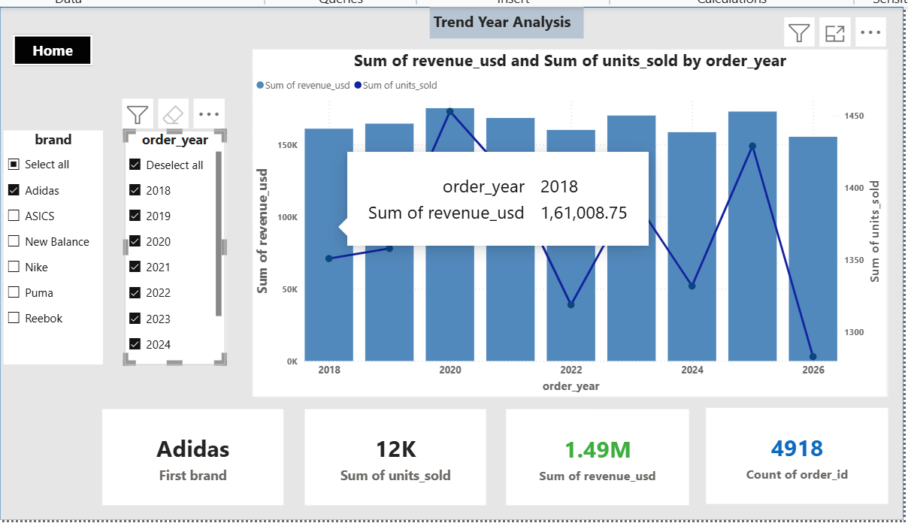

# 👟 Global Footwear Sales Analysis  
## 📊 Exploratory Data Analysis (EDA) + Power BI Dashboard

---

## 📌 Project Overview

This project performs an **end-to-end Exploratory Data Analysis (EDA)** on a Global Footwear Sales dataset and builds an interactive **Power BI Dashboard** to generate business insights.

The objective of this project is to:

- Analyze sales performance across brands, categories, and countries
- Identify revenue and unit trends over time
- Understand customer demographics and behavior
- Support data-driven business decision making

---

## 🧠 Business Questions Answered

- Which brand generates the highest revenue?
- Which country performs the best?
- Which category drives maximum sales?
- What are the yearly and monthly sales trends?
- Which payment method is most preferred?
- How do gender and income levels impact purchasing?

---

## 📂 Project Workflow
  Raw Dataset
  ↓
  Data Cleaning (Python - Pandas)
  ↓
  Exploratory Data Analysis (EDA)
  ↓
  Business Insights
  ↓
  Power BI Dashboard
  ↓
  Interactive Visual Reporting

---

## 🛠️ Tools & Technologies Used

### 🐍 Python
- Pandas
- Matplotlib

### 📊 Power BI
- Data Modeling
- DAX
- KPI Cards
- Slicers & Filters
- Interactive Dashboards

---

# 🔎 Exploratory Data Analysis (EDA)

## 📌 Data Cleaning Steps

- Checked missing values
- Removed duplicates
- Converted date columns
- Extracted year and month from order date
- Validated data types
- Created calculated columns

---

## 📊 Key EDA Insights

### 🏷️ Brand Analysis
- Adidas, Nike, ASICS, and Reebok dominate revenue.
- 

### 🌍 Country Analysis

### 👟 Category Analysis
- Basketball and Training categories drive the highest unit sales.

### 📅 Time Analysis
- Revenue peaks observed between 2020–2023.

- Overall stable growth trend.

### 👥 Customer Demographics
- Orders are evenly distributed among Men, Women, and Unisex.
- Medium and Low income segments contribute significantly.

- Average customer rating: **4.0**
### 💳 Payment Methods
- Card and Bank Transfer are the most preferred payment methods.
- Cash usage is slightly lower than digital payments.

---

# 📊 Power BI Dashboard Pages

---

## 🏠 1️⃣ Home Dashboard

  

**KPIs:**
- Total Revenue: 1.52M USD  
- Total Orders: 4,991  
- Total Units Sold: 13K  
- Top Country: India  

Includes:
- Revenue vs Units trend
- Income level distribution
- Gender analysis

---

## 📊 2️⃣ Bivariate Analysis

  

- Revenue by Brand
- Units Sold by Brand
- Orders by Payment Method

---

## 🏷️ 3️⃣ Categorical Analysis

- Units Sold by Category
- Revenue by Brand
- Color distribution
- Average customer rating

---

## 🌎 4️⃣ Country & Region Analysis

### Page 1

### Page 2

Includes:
- Units Sold by Size
- Category performance by region
- Sales channel comparison
- Payment behavior analysis

---

## 📅 5️⃣ Trend Analysis

### 📆 Monthly Trend

### 📈 Yearly Trend

- Revenue & Units Sold comparison
- Seasonal patterns
- Growth analysis

---

# 📈 Business Impact

This project enables stakeholders to:

- Identify top-performing brands
- Optimize category strategies
- Improve regional sales performance
- Monitor yearly and monthly growth
- Understand customer behavior patterns

---

# 📁 Repository Structure

